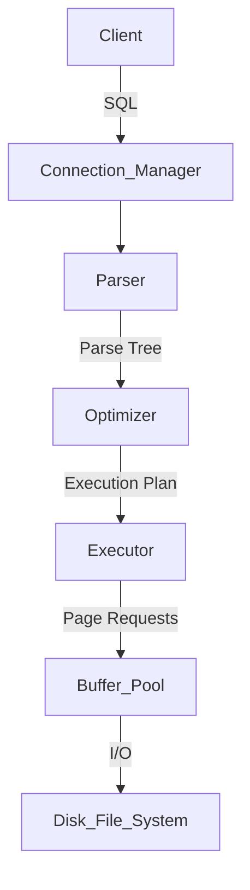

# 💾 Database Storage Internals - Layered Engineering Guide

> **Document Level:** Senior → Architect  
> **Last Updated:** February 2026 | **Prerequisites:** [01-sql-basics.md](./01-sql-basics.md)

---

## 📋 Table of Contents

1. [Layer 1: The Life of a Query](#layer-1-the-life-of-a-query)
2. [Layer 2: Storage Engines (B-Trees vs LSM Trees)](#layer-2-storage-engines-b-trees-vs-lsm-trees)
3. [Layer 3: ACID Mechanics (The WAL)](#layer-3-acid-mechanics-the-wal)
4. [Layer 4: Buffer Pool Management](#layer-4-buffer-pool-management)

---

## Layer 1: The Life of a Query

When you run `SELECT * FROM users`, the database performs a complex ballet.

### The Architecture

1.  **Connection Manager**: Handles TCP handshake, SSL, authentication.
2.  **Parser**: Validates syntax (`SELECT` valid? Table exists?). Creates a Parse Tree.
3.  **Optimizer** (The Brain): Finds the cheapest way to execute.
    *   *Should I scan the whole table?*
    *   *Should I use the `idx_email` index?*
    *   *Cost Calculation*: `Cost = I/O Cost + CPU Cost`.
4.  **Executor**: Runs the plan steps. It doesn't know about disk; it just asks for "Pages".
5.  **Storage Engine** (The Worker): Manages memory and disk. (InnoDB, MyISAM, RocksDB).

---

## Layer 2: Storage Engines (B-Trees vs LSM Trees)

How is data actually stored on disk?

### 1. B-Tree (Read Optimized)
Used by: **PostgreSQL, MySQL (InnoDB), Oracle**.

*   **Structure**: Balanced Tree. Data is stored in **Pages** (usually 8KB or 16KB).
*   **Update Strategy**: Update-in-place. To change a row, find the page, modify it, write it back.
*   **Pros**:
    *   Fast Reads (O(log N)).
    *   Great for Range Queries (`WHERE age > 20`).
*   **Cons**:
    *   Random Writes are slow (disk head seeks).
    *   Write Amplification (changing 1 byte often requires rewriting 16KB).

### 2. LSM Tree (Log-Structured Merge Tree) (Write Optimized)
Used by: **Cassandra, RocksDB, LevelDB, HBase**.

*   **Structure**:
    1.  **MemTable**: In-memory buffer. All writes go here first (Fast!).
    2.  **SSTable (Sorted String Table)**: Immutable disk files. When MemTable is full, it flushes to disk as an SSTable.
    3.  **Compaction**: Background process merges old SSTables to remove deleted data.
*   **Pros**:
    *   Blazing Fast Writes (Append-only).
*   **Cons**:
    *   Slower Reads (Must check MemTable + multiple SSTables).
    *   Space Amplification (Old data usually lingers until compaction).

### Architect Decision
*   **OLTP (Banking, E-commerce)** -> **B-Tree** (We need fast, consistent reads).
*   **High-Volume Ingestion (Logs, IoT, Chat History)** -> **LSM Tree** (We need to write 1M rows/sec).

---

## Layer 3: ACID Mechanics (The WAL)

If the power plug is pulled at the exact millisecond of a transaction commit, how does the database not lose data?

### The WAL (Write-Ahead Log) protocol
**Rule**: "Log it before you do it."

1.  **Client**: `UPDATE accounts SET balance = 0`
2.  **DB**: Creates a log entry in memory: `TXN_1: UPDATE accounts ID=5 OLD=100 NEW=0`.
3.  **DB**: Flushes this log entry to the **WAL File** on disk (Sequential Write = Fast).
    *   `fsync()` is called to ensure it hits the physical platter.
4.  **DB**: Modifies the actual data page in **Memory (Buffer Pool)**. It does *not* write the data page to disk yet (that's slow).
5.  **DB**: Sends "Success" to Client.

**Crash Scenario**:
*   Power fails.
*   RAM is wiped (The data page with `balance=0` is lost).
*   **Recovery**: On reboot, DB reads the **WAL**. It sees `TXN_1` committed. It **Replays** the change to the data page. Data is safe.

---

## Layer 4: Buffer Pool Management

Disk I/O is slow (milliseconds). RAM is fast (nanoseconds).
The **Buffer Pool** is the database's internal cache.

### How it works
*   Database never operates directly on disk files.
*   It asks: "Is Page 45 in Buffer Pool?"
    *   **Hit**: Return page from RAM.
    *   **Miss**: Read Page 45 from disk -> Put in Buffer Pool -> Return.

### Eviction Policy (LRU)
RAM is finite. When full, we must kick a page out.
**LRU (Least Recently Used)**: Evict the page that hasn't been touched in the longest time.

**Dirty Pages**:
*   If a page in RAM has been modified but not yet written to disk, it is **Dirty**.
*   We cannot just drop a Dirty Page. We must flush it to disk first by a **Checkpointer** process.

**Architect Tuning**:
*   **buffer_pool_size**: The most important setting.
*   Start with **70-80% of total RAM** for dedicated DB servers.
*   If too small -> Disk Thrashing (constant reading/writing).
*   If too large -> OS swap usage (Performance cliff).
