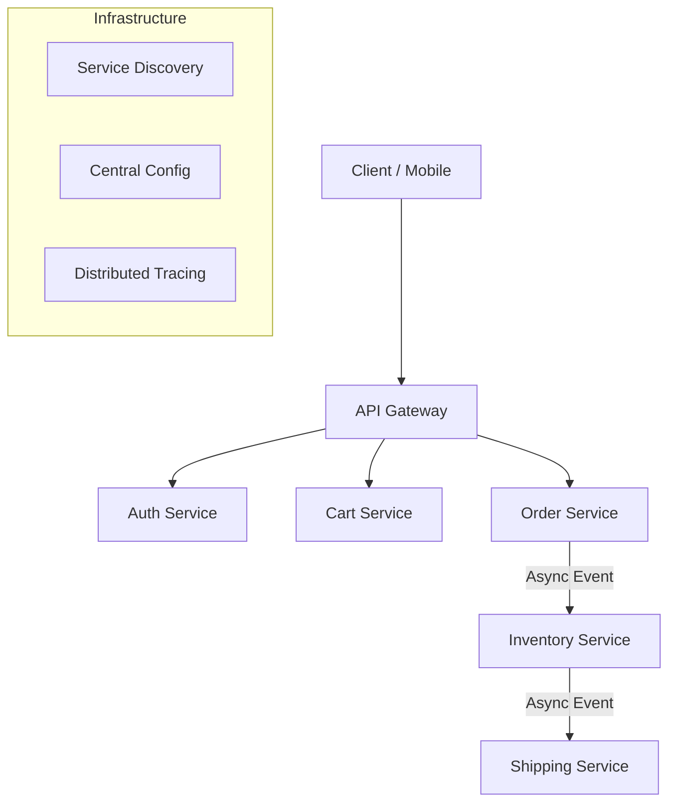

# 01. Microservices Architecture Fundamentals

> **Part 1: Foundations**  
> **Difficulty:** ⭐⭐⭐⭐ (Architect)  
> **Status:** Production-Grade

---

## 0. Learning Objectives

| Level | Goal |
|:---|:---|
| **Beginner** | Understand what a microservice is and isn't. |
| **Developer** | Learn the 3 dimensions of the Scale Cube (X, Y, Z). |
| **Architect** | Master the "Fallacies of Distributed Computing" and Trade-off analysis. |

---

## 1. Why This Topic Exists

### The Business Problem
Businesses need **Agility**. A feature request ("Add Apple Pay") shouldn't require testing the entire ERP system.

### The Technical Challenge
In a Monolith, everything is coupled. A memory leak in the "Reporting Module" crashes the "Checkout Module".
Microservices exist to **decouple failure domains** and enable **independent deployability**.

### The Paradox
> "Microservices solve organizational problems (teams stepping on each other) by creating technical problems (distributed systems)."

---

## 2. Big Picture Architecture View

*   **Interaction**: Services communicate over HTTP/gRPC (Sync) or Kafka (Async).
*   **Discovery**: Services find each other dynamically (Not hardcoded IPs).
*   **Observability**: A distributed request must be traceable across all nodes.

---

## 3. Core Concepts (🟢 Beginner Level)

### What is a Microservice?
A small, autonomous service that:
1.  Does **one thing** well (Single Responsibility).
2.  Can be **deployed independently**.
3.  Owns its own **data** (Database per Service).

### Real-Life Analogy: The Restaurant
*   **Monolith**: One Super-Chef doing everything (Cooking, Serving, Cleaning procssing payments). If he gets sick, restaurant closes.
*   **Microservices**:
    *   Chef Service (Cooks)
    *   Waiter Service (Serves)
    *   Cashier Service (Payments)
    *   **Benefit**: You can hire 5 more Waiters (Scale Y-Axis) without hiring more Chefs.

---

## 4. Developer Deep Dive (🟡 Professional Level)

### The Scale Cube (AKF Partners)
How do we scale?

1.  **X-Axis (Horizontal Optimization)**:
    *   *What*: Run multiple copies of the same app behind a Load Balancer.
    *   *Spring Boot*: `docker-compose up --scale order-service=3`.
2.  **Y-Axis (Functional Decomposition)**:
    *   *What*: Split the Monolith by function (Cart, User, Order).
    *   *This is Microservices*.
3.  **Z-Axis (Data Partitioning / Sharding)**:
    *   *What*: Split by Customer ID. (Users 1-1000 go to Pod A, 1001-2000 go to Pod B).
    *   *Complex*: Routing logic handled by Gateway or Smart Client.

### Spring Cloud Implementation
*   **@EnableDiscoveryClient**: Registers with Eureka.
*   **@FeignClient**: Declarative REST client for inter-service calls.

---

## 5. Internal Mechanics (🔴 Architect Level)

### The Fallacies of Distributed Computing (L. Peter Deutsch)
If you ignore these, your system **will fail**.

1.  **The Network is Reliable**: It's not. Packets drop. Switches reset.
    *   *Fix*: Retries, Timeouts, Circuit Breakers.
2.  **Latency is Zero**: It's not. Local call = 100ns. Remote call = 50ms (500,000x slower).
    *   *Fix*: Caching, Async Events, Batching.
3.  **Bandwidth is Infinite**: It's not. Don't send `Select *`.
    *   *Fix*: GraphQL, Pagination, Compression.
4.  **The Network is Secure**: It's not.
    *   *Fix*: mTLS, Zero Trust.
5.  **Topology doesn't change**: It does. Pods die and restart on new IPs.
    *   *Fix*: Service Discovery.
6.  **There is one admin**: No. Deployment is decentralized.
7.  **Transport cost is zero**: Serialization (JSON) is expensive CPU work.
8.  **The network is homogeneous**: Mobile, Web, IoT have different constraints.

---

## 6. Production & Failure Scenarios

### Scenario 1: The Cascading Failure
*   **Event**: The "Recommendation Service" becomes slow (Database lock).
*   **Impact**: "Product Service" calls it. Threads pile up waiting.
*   **Result**: "Product Service" runs out of threads and dies. "Gateway" calls Product, runs out of threads, dies. **Total Outage**.
*   **Fix**: **Timeouts** (Fail fast) and **Bulkheads** (Thread pool isolation).

### Scenario 2: The Network Partition (Split Brain)
*   **Event**: A network switch fails. Zone A cannot talk to Zone B.
*   **Impact**: Database Leader in Zone A cannot talk to Follower in Zone B.
*   **Technique**: CAP Theorem decision (Consistency vs Availability).

---

## 7. Performance & Scalability Considerations

| Metric | Monolith | Microservices | Architecture Fix |
|:---|:---|:---|:---|
| **Latency** | Low (In-memory) | High (Network hops) | Caching (Redis), Async (Kafka) |
| **Throughput** | Limited by single DB | High (Parallel processing) | Event-Driven Architecture |
| **Resource Usage** | Efficient (Shared JVM) | High (JVM Overhead per process) | Native Images (GraalVM), Golang sidecars |

### Bottleneck Analysis
*   **Serialization**: JSON parsing can consume 30% of CPU. Use Protobuf (gRPC) for internal traffic.
*   **Connection Handshakes**: SSL handshakes are expensive. Use Persistent Connections (Keep-Alive).

---

## 8. Security Considerations

### Attack Surface
*   **Monolith**: One entry point. Hard shell, soft center.
*   **Microservices**: Hundreds of entry points. Every service is a target.

### Secure Patterns
1.  **mTLS**: Authenticate machine-to-machine.
2.  **Token Propagation**: Pass JWT `Authorization` header downstream. Never perform "Implicit Trust".
3.  **Rate Limiting**: Protect individual services from DDOS (internal or external).

---

## 9. Architect-Level Best Practices

1.  **Database per Service**: Non-negotiable. Sharing tables = logic coupling.
2.  **Async First**: If user doesn't need immediate answer, use Kafka.
3.  **Observe Everything**: Log *correlation_id* everywhere.
4.  **Fail Gracefully**: If "Recommendations" is down, show "Popular Items" (Fallback), don't crash "Homepage".
5.  **Smart Endpoints, Dumb Pipes**: Logic belongs in services, not the ESB/Message Bus.

---

## 10. Anti-Patterns & Common Mistakes

### 1. The Distributed Monolith
*   **Symptom**: You have to deploy Service A and Service B together because they share a library that changed.
*   **Cause**: Shared DTO libraries, Shared Database.
*   **Fix**: Duplicate code rather than couple it.

### 2. Resume Driven Development
*   **Symptom**: Implementing Kubernetes for a 2-service system.
*   **Cause**: Bored engineers.
*   **Fix**: Start Monolithic. Extract *only* when pain is felt.

### 3. Nanoservices
*   **Symptom**: Services that are basically just one function.
*   **Result**: Latency > Processing Time.
*   **Fix**: Aggregate cohesively. Services should generally manage a whole Aggregate (DDD).

---

## 11. Debugging & Troubleshooting Guide

### Issue: "The system is slow"
1.  **Check Metrics**: Is it CPU? Memory? Disk I/O?
2.  **Check Traces (Jaeger)**:
    *   Find the longest bar.
    *   Is it a Database query? -> Optimize SQL.
    *   Is it a downstream call? -> Check that service.
    *   Is it "Gap time"? -> GC Pause or Thread Starvation.
3.  **Check Logs**: Search for `ERROR` with the same `TraceId`.

---

## 12. Interview Questions

### Basic
1.  What is the main difference between Monolithic and Microservices architecture?
2.  What is the benefit of independent deployment?
3.  What is an API Gateway?
4.  Why is "Shared Database" an anti-pattern?
5.  What is a Container?

### Intermediate
1.  Explain the Strangler Fig pattern.
2.  What is the role of Service Discovery?
3.  How do you handle distributed transactions? (Saga).
4.  RPC vs REST vs Events - when to use which?
5.  How do you prevent cascading failures?

### Advanced
1.  Explain the CAP theorem. Which two do you usually pick in Microservices? (AP).
2.  How does a Circuit Breaker work internally? (Open/Closed/Half-Open states).
3.  What is the difference between Blue/Green and Canary deployment?
4.  Why is "Serialization" a performance bottleneck?
5.  How do you debug a request that spans 10 services?

### Architect-Level
1.  Design a system that guarantees "Exactly-Once" processing using Kafka and Idempotency keys.
2.  How would you migrate a legacy procedure with 5000 lines of SQL stored procedure logic to Microservices?
3.  Discuss the trade-offs of Sidecar pattern vs Library integration for Resilience.
4.  How do you handle "Dual Write" problems when migrating from Monolith to Microservices?
5.  Your system has high read latency. Design a caching strategy that ensures eventual consistency.

---

## 13. Scenario-Based Architecture Questions

1.  **High Scale**: "Design a Ticketmaster clone. Traffic spikes 1000x in 1 second." (Focus on Queueing, Rate Limiting, Async).
2.  **Cascading Failure**: "Service A calls B, B calls C. C hangs. A crashes. Fix it." (Timeouts, Bulkheads).
3.  **Migration**: "We have a 10-year old Java Monolith. We need to move to K8s. Plan the roadmap." (Lift & Shift vs Strangler).
4.  **Network Partition**: "Two data centers lose connectivity. How does the DB handle writes?" (Split brain, Quorums).
5.  **Security**: "Internal rogue developer is calling the 'Payroll Service' directly. How to stop?" (mTLS, Network Policy).
6.  **Optimizing Latency**: "Login takes 3 seconds. It calls 5 services. Improve it." (Parallel calls, Caching).
7.  **Data Consistency**: "Order Placed, but Inventory didn't deduct. Fix the data." (Reconciliation jobs, Sagas).
8.  **Eventual Consistency**: "User updated profile, but doesn't see it on dashboard immediately. Why?" (Read replica lag).

---

## 14. Summary & Architect Takeaways

*   **Complexity**: Microservices are **more complex** than monoliths. Only use them if you have the organizational scale to justify the cost.
*   **Infrastructure**: You need a mature platform (K8s, CI/CD, Observability) *before* you start.
*   **Design**: Boundaries are everything. Get the DDD Bounded Contexts right, or you build a Distributed Monolith.
*   **Failure**: Assume everything will fail. Network, Disk, CPU. Design for resilience.
