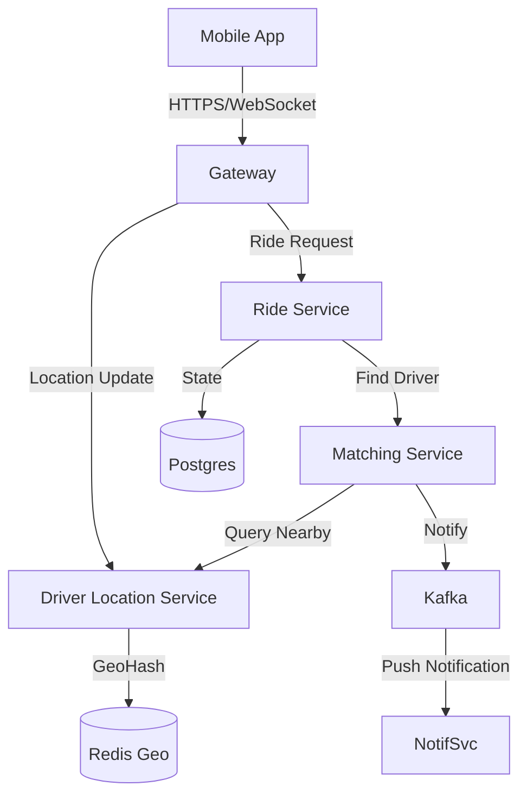

# 04. Final Project: The "Uber" Clone Architecture

> **Part 10: Interview & Scenario Kit**  
> **Difficulty:** ⭐⭐⭐⭐⭐ (Capstone)  
> **Status:** The Ultimate Test

---

## 1. System Requirements

*   **Riders**: Can request a ride. See driver location. Pay.
*   **Drivers**: Can accept a ride. Update location. Get paid.
*   **Scale**: 10M DAU. 1M concurrent drivers.

---

## 2. High-Level Components

---

## 3. The Hard Problems

### A. Geospatial Indexing (Where are the drivers?)
*   **Naive**: `SELECT * FROM drivers WHERE dist(me, driver) < 5km`. (Too slow for 1M drivers).
*   **Solution**: **GeoHash**. Divide the world into grids.
    *   Driver A is in Grid `u4pru`.
    *   Rider is in Grid `u4pru`.
    *   Query: `GET drivers WHERE grid = 'u4pru'`. (O(1) lookup).
*   **Storage**: Redis `GEOADD` and `GEORADIUS`.

### B. Surge Pricing (Supply vs Demand)
*   **Service**: `PricingService`.
*   A background job calculates `% of Busy Drivers` in each Grid every 5 minutes.
*   If `Busy > 90%`, set `Multiplier = 2.0` in Redis.

### C. Matching (The Dispatcher)
*   **Strategy**: Sticky Assignment vs Broadcast.
    *   **Broadcast**: Send "New Ride" to 10 nearest drivers. First to accept wins. (Simpler / Race Conditions).
    *   **Assignment**: Server picks Driver A. Driver A has 10s to accept. If timeout, pick Driver B. (Better UX).

---

## 4. Database Schema (Postgres)

*   `rides`: `id`, `rider_id`, `driver_id`, `status` (REQUESTED, MATCHED, STARTED, ENDED), `pickup_lat`, `pickup_lng`.
*   `driver_locations`: (Ephemeral) Stored in Redis. Only persist "Last Known" to DB for audit.

---

## 14. Architecture Review

*   **Consistency**: Rides must be ACID (Postgres). Location updates can be Eventual (Redis).
*   **Resilience**: If Redis dies, we lose "Live Locations" (Okay). We don't lose "Ride History" (Critical).
