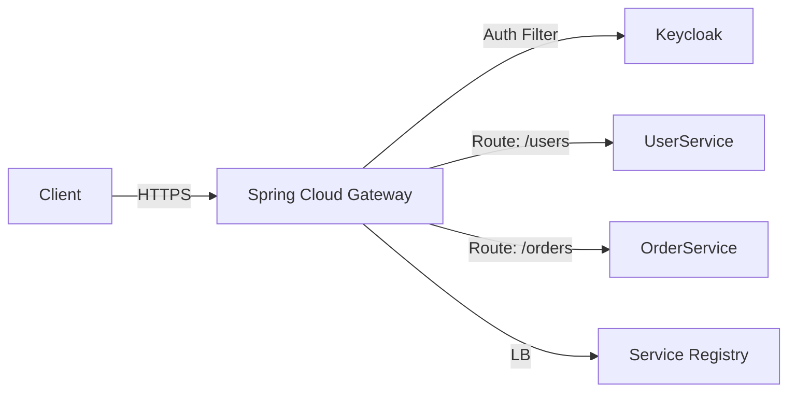

# 01. API Gateway with Spring Cloud Gateway

> **Part 2: Spring Cloud Core**  
> **Difficulty:** ⭐⭐⭐⭐ (Architect)  
> **Status:** Production-Grade

---

## 0. Learning Objectives

| Level | Goal |
|:---|:---|
| **Beginner** | Understand why we need a single entry point (Gateway). |
| **Developer** | Configure Routes using `application.yml` and Java DSL. |
| **Architect** | Master Cross-Cutting Concerns (Auth, Rate Limiting) and Non-Blocking I/O. |

---

## 1. Why This Topic Exists

### The Problem
If you have 50 microservices, you cannot ask the Mobile App to know 50 different IP addresses.
Also, you don't want to implement SSL, CORS, and Authentication 50 times.

### The Solution
**API Gateway**: A server that acts as a single entry point into the system. It encapsulates the internal architecture.
**Spring Cloud Gateway**: Built on Spring WebFlux (Reactor), it provides a non-blocking, high-throughput gateway.

---

## 2. Big Picture Architecture View



*   **Reverse Proxy**: Hides backend services.
*   **Offloading**: Handles SSL termination and Auth validation.

---

## 3. Core Concepts (🟢 Beginner Level)

### 1. Route
The basic building block.
*   **ID**: Unique name (`order-service`).
*   **URI**: Where to send traffic (`lb://ORDER-SERVICE`).
*   **Predicates**: *When* to match (`Path=/orders/**`).
*   **Filters**: *What* to do (`AddRequestHeader`).

### 2. Predicate
Java 8 Function `Predicate<ServerWebExchange>`.
*   *Matches*: Path, Method, Header, Host, Cookie.

### 3. Filter
Middleware chain.
*   **Pre-Filter**: Run *before* sending to downstream (Add Auth Header).
*   **Post-Filter**: Run *after* response comes back (Add CORS headers).

---

## 4. Developer Deep Dive (🟡 Professional Level)

### Configuration (YAML)

```yaml
spring:
  cloud:
    gateway:
      routes:
        - id: user-service
          uri: lb://USER-SERVICE  # "lb" = Load Balancer (Eureka)
          predicates:
            - Path=/users/**
            - Method=GET
          filters:
            - AddRequestHeader=X-Source, Gateway
            - name: CircuitBreaker
              args:
                name: userServiceBreaker
                fallbackUri: forward:/fallback
```

### Configuration (Java DSL)

```java
@Bean
public RouteLocator customRouteLocator(RouteLocatorBuilder builder) {
    return builder.routes()
        .route("order_route", r -> r.path("/orders/**")
            .filters(f -> f.addResponseHeader("X-Powered-By", "Spring-Cloud-Gateway"))
            .uri("lb://ORDER-SERVICE"))
        .build();
}
```

---

## 5. Internal Mechanics (🔴 Architect Level)

### Reactive & Non-Blocking (Netty)
SCG is **NOT** compatible with Spring MVC (Tomcat). It runs on **Netty**.
*   **Thread Model**: Event Loop. A small number of threads (equal to CPU cores) handle thousands of concurrent requests.
*   **Impact**:
    *   **Throughput**: Massive (can handle 20k+ req/sec).
    *   **Blocking**: You CANNOT block the thread (e.g., `Thread.sleep` or JDBC is forbidden). You must use Reactive drivers (R2DBC, WebClient).

### Filters Chain
`GatewayFilter` vs `GlobalFilter`.
1.  **Global**: Runs for *every* request (e.g., Logging, Metrics).
2.  **Gateway**: Runs for specific routes.

---

## 6. Production & Failure Scenarios

### Scenario: The Thundering Herd
*   **Event**: Downstream service slows down.
*   **Impact**: Gateway connections pile up. Netty runs out of memory (OOM).
*   **Fix**: **Timeouts** (`connect-timeout`, `response-timeout`) and **Circuit Breakers**.

### Scenario: Token Relay Failure
*   **Event**: Gateway validates OAuth2 token but forgets to pass it downstream.
*   **Impact**: Downstream service rejects request (`401 Unauthorized`).
*   **Fix**: `TokenRelay` filter in SCG.

---

## 7. Performance & Scalability Considerations

| Metric | Zuul 1 (Blocking) | Spring Cloud Gateway (Reactive) |
|:---|:---|:---|
| **Thread Model** | 1 Thread per Request | Event Loop |
| **Blocking?** | Yes | No |
| **Websocket?** | No | Yes |
| **Throughput** | Medium | High |

### Tuning Netty
*   `reactor.netty.ioWorkerCount`: Defaults to CPU cores. Don't increase arbitrarily.
*   **Buffers**: Increase `spring.codec.max-in-memory-size` if handling large JSON bodies.

---

## 8. Security Considerations

### 1. Unified Authentication
Gateway acts as an **OAuth2 Resource Server**.
*   Validates JWT signature from Keycloak/Okta.
*   Rejects invalid tokens immediately (Downstream services are protected).

### 2. CORS (Cross-Origin Resource Sharing)
Handle CORS *once* at the Gateway, not in every microservice.
```yaml
spring:
  cloud:
    gateway:
      globalcors:
        cors-configurations:
          '[/**]':
            allowedOrigins: "https://myapp.com"
            allowedMethods: "GET,POST"
```

---

## 9. Architect-Level Best Practices

1.  **BFF Pattern**: Create separate routes/filters for Mobile vs Web if payloads differ widely.
2.  **Rate Limiting**: Use Redis-backed Rate Limiter (`RequestRateLimiter`) to prevent abuse.
    *   *Algorithm*: Token Bucket.
3.  **Keep it Logic-Free**: Do **NOT** put business logic in the Gateway. It is infrastructure. It should only do Routing and Cross-Cutting concerns.

---

## 10. Anti-Patterns & Common Mistakes

### 1. The "God" Gateway
Putting Transformation logic (`UserDTO` -> `UserEntity`) in the Gateway.
*   *Result**: Gateway becomes a bottleneck and deployment nightmare.

### 2. Blocking Calls
Using blocking libraries (JDBC, RestTemplate) inside a Custom Filter.
*   *Result**: Paralyzes the standard Event Loop. Gateway freezes.

---

## 11. Debugging & Troubleshooting Guide

### Issue: "404 Not Found"
1.  **Check Predicates**: Does the Path match strictly? (Trailing slash?).
2.  **Check Discovery**: Is the service registered in Eureka? (`lb://SERVICE` needs Eureka).
3.  **Logs**: Enable `TRACE` level for `org.springframework.cloud.gateway`.

### Issue: "Timeout"
1.  Check if downstream is reachable via `curl` from inside the Gateway pod.
2.  Check `spring.cloud.gateway.httpclient.response-timeout`.

---

## 12. Interview Questions

### Basic
1.  What is the purpose of an API Gateway?
2.  Difference between pre-filter and post-filter?
3.  How does Gateway find the service IP? (Service Discovery).

### Intermediate
1.  Why is Spring Cloud Gateway non-blocking?
2.  What is the "Token Relay" pattern?
3.  How do you implement Rate Limiting in SCG? (Redis).

### Advanced
1.  Compare Spring Cloud Gateway vs Nginx/Kong. (SCG is Java/Code-centric, Kong is Lua/Config-centric).
2.  How does the Event Loop model handle high concurrency?

### Architect-Level
1.  Design a "Canary Deployment" strategy using SCG Weighted Routing.
2.  How would you debug high memory usage in a Netty-based Gateway? (Leak detection, Heap dump).

---

## 13. Scenario-Based Architecture Questions

1.  **Migration**: "We are moving from a Monolith to Microservices. How can Gateway help?"
    *   *Ans*: Strangler Fig Pattern. Gateway routes new endpoints to new services, old endpoints to Legacy.
2.  **Security**: "We need to ensure only Mobile App calls our API, not `curl` scripts."
    *   *Ans*: App Attestation / mTLS (Hard). Or verify specific headers/Signing (Easier but spoofable).
3.  **Performance**: "Gateway is adding 50ms latency. Why?"
    *   *Ans*: Check GC pauses, Filters doing blocking I/O, or network hops.

---

## 14. Summary & Architect Takeaways

*   **Front Door**: The Gateway is the most critical component. If it dies, everything dies. High Availability (HA) is mandatory.
*   **Reactive Mindset**: You must understand `Mono`/`Flux` to write custom filters.
*   **Security Perimeter**: It is your first line of defense. Audit it heavily.
