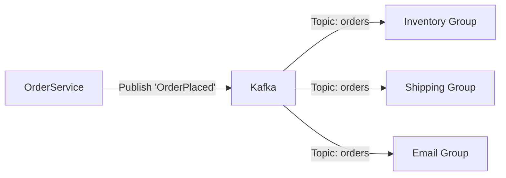

# 05. Async Communication (Kafka & Spring Cloud Stream)

> **Part 2: Spring Cloud Core**  
> **Difficulty:** ⭐⭐⭐⭐⭐ (Architect)  
> **Status:** High Scale

---

## 0. Learning Objectives

| Level | Goal |
|:---|:---|
| **Beginner** | Understand the difference between Command (REST) and Event (Kafka). |
| **Developer** | Implement Producers and Consumers using Spring Cloud Stream. |
| **Architect** | Design Scalable Event-Driven flows with Consumer Groups and DLQs. |

---

## 1. Why This Topic Exists

### The Coupling Problem
REST is synchronous. `Order -> Inventory -> Shipping`.
If Shipping is down, Order fails. This is **Temporal Coupling**.

### The Solution: Event-Driven
`Order` raises `OrderPlaced` event. `Inventory` and `Shipping` listen.
If Shipping is down, it processes the event *later*. No lost orders.

---

## 2. Big Picture Architecture View



*   **Fan-out**: One event triggers multiple actions.

---

## 3. Core Concepts (🟢 Beginner Level)

### Spring Cloud Stream
An abstraction framework. You write code that talks to "Channels", and the framework binds them to Kafka/RabbitMQ.

### Consumer Group
A set of instances sharing the work.
*   If you have 5 partitions and 5 instances of `InventoryService` in a group, each instance reads 1 partition.
*   Horizontal scaling for message processing.

---

## 4. Developer Deep Dive (🟡 Professional Level)

### Functional Style (Modern)
Defined as simple Java Functions.

```java
@Configuration
public class EventConfig {

    // Producer (Supplier)
    @Bean
    public Supplier<OrderEvent> orderProducer() {
        return () -> new OrderEvent(123);
    }

    // Processor (Function)
    @Bean
    public Function<OrderEvent, InventoryCalculatedEvent> inventoryProcessor() {
        return event -> {
             // Calculate Logic
             return new InventoryCalculatedEvent();
        }
    }

    // Consumer (Consumer)
    @Bean
    public Consumer<InventoryCalculatedEvent> shippingConsumer() {
        return event -> {
            System.out.println("Shipping for order: " + event.id);
        };
    }
}
```

*`application.yml`*:
```yaml
spring:
  cloud:
    stream:
      bindings:
        shippingConsumer-in-0:
          destination: inventory-topic
          group: shipping-group
```

---

## 5. Internal Mechanics (🔴 Architect Level)

### Kafka vs RabbitMQ
*   **RabbitMQ**: Message is removed after ack. Good for complex routing.
*   **Kafka**: Log based. Message stays. Good for high throughput and replay.

### Partitioning
Kafka guarantees ordering **only within a partition**.
*   *Key*: OrderID.
*   All events for `Order #123` must go to Partition 1 to ensure "Created" comes before "Shipped".

---

## 6. Production & Failure Scenarios

### Scenario: The Poison Pill
*   **Event**: A malformed message crashes the Consumer (Exception).
*   **Result**: Consumer restarts, reads message again, crashes again. **Infinite Loop**.
*   **Fix**: **DLQ (Dead Letter Queue)**.
    *   Config: `auto-dlq: true`.
    *   After 3 retries, move faulty message to `orders-dlq`. Alert admin.

---

## 9. Architect-Level Best Practices

1.  **Idempotency**: Events are "At Least Once". You might receive the same "OrderPlaced" twice. Your Database insert must handle this (`ON CONFLICT DO NOTHING`).
2.  **Schema Evolution**: Use **Avro** and Schema Registry. Don't break consumers by renaming fields.
3.  **Async for everything**: If the user doesn't need the answer *right now*, put it in a queue.

---

## 10. Anti-Patterns & Common Mistakes

### 1. Fat Events vs Thin Events
*   *Thin*: `{id: 123}`. Consumer calls API to get details. (DDoS risk).
*   *Fat*: `{id: 123, price: 99, customer: ...}`. (Self-contained, but data might be stale).
*   *Rec*: Fat Events generally preferred for autonomy.

---

## 12. Interview Questions

### Basic
1.  Difference between Queue and Topic?
2.  What is a Consumer Group?

### Intermediate
1.  How does Spring Cloud Stream bind code to Kafka?
2.  What is a DLQ?

### Advanced
1.  How do you guarantee ordering in Kafka? (Partition Key).
2.  Compare "At-Least-Once", "At-Most-Once", and "Exactly-Once".

### Architect-Level
1.  Design an Event Sourcing system using Kafka.
2.  How do you handle Distributed Transactions with Events? (Saga Pattern).

---

## 14. Summary & Architect Takeaways

*   **Decoupling**: Events are the ultimate decoupler.
*   **Complexity**: Debugging async flows is hard. You need Distributed Tracing.
*   **Power**: Allows massive scalability by buffering load.
