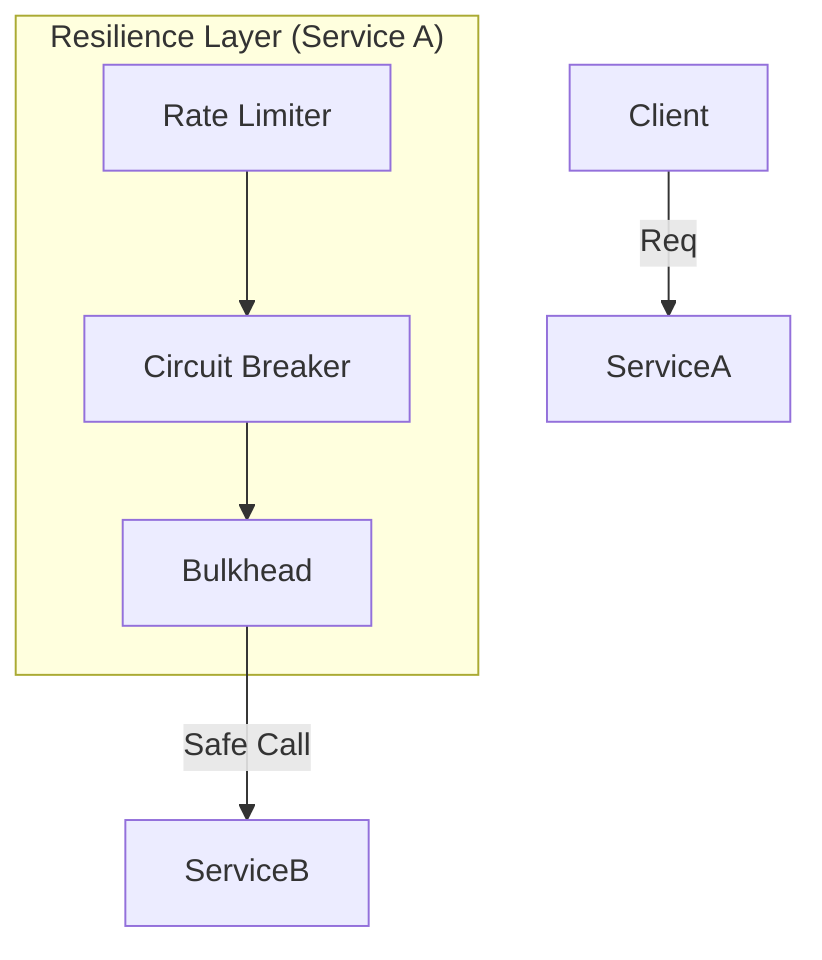

# 01. Resilience Patterns (Circuit Breaker, Retry, Rate Limiter)

> **Part 3: Resilience & Fault Tolerance**  
> **Difficulty:** ⭐⭐⭐⭐ (Architect)  
> **Status:** Critical production Safety

---

## 0. Learning Objectives

| Level | Goal |
|:---|:---|
| **Beginner** | Understand why we need to fail fast. |
| **Developer** | Implement Resilience4j annotations (`@CircuitBreaker`, `@Retry`). |
| **Architect** | Design Bulkheads and define SLA-based Rate Limits. |

---

## 1. Why This Topic Exists

### The Domino Effect
In a distributed system, if Service A depends on Service B, and Service B hangs:
1.  Service A threads wait for B.
2.  Service A runs out of threads.
3.  Service A hangs.
4.  Gateway calls A, hangs.
5.  **Total System Crash**.

### The Solution: Fault Tolerance
We need mechanisms to:
*   **Fail Fast**: If B is down, stop calling it. (Circuit Breaker).
*   **Try Again**: If B just blinked, retry. (Retry).
*   **Slow Down**: If A is overwhelming B, throttle requests. (Rate Limiter).

---

## 2. Big Picture Architecture View



---

## 3. Core Concepts (🟢 Beginner Level)

### Circuit Breaker 🔌
Analogous to an electrical fuse.
*   **Closed**: Current flows (Calls go through).
*   **Open**: Fuse blown (Calls fail immediately).
*   **Half-Open**: Test mode (Let 1 call through to see if electricity is back).

### Bulkhead 🚢
Ship compartments. If one floods, the ship floats.
*   Isolating thread pools so "Image Processing" doesn't starve "User Login".

---

## 4. Developer Deep Dive (🟡 Professional Level)

### Resilience4j with Spring Boot

**1. Dependency**
`spring-cloud-starter-circuitbreaker-resilience4j`

**2. Annotation Usage**

```java
@Service
public class OrderService {

    @CircuitBreaker(name = "inventory", fallbackMethod = "defaultInventory")
    @Retry(name = "inventory")
    @RateLimiter(name = "inventory")
    public InventoryDTO getInventory(String id) {
        return inventoryClient.findById(id);
    }
    
    public InventoryDTO defaultInventory(String id, Throwable t) {
        return new InventoryDTO(id, 0); // Graceful degradation
    }
}
```

**3. Configuration (YAML)**

```yaml
resilience4j:
  circuitbreaker:
    instances:
      inventory:
        failureRateThreshold: 50 # Open if 50% fail
        waitDurationInOpenState: 10s
        slidingWindowSize: 10
  retry:
    instances:
      inventory:
        maxAttempts: 3
        waitDuration: 1s
```

---

## 5. Internal Mechanics (🔴 Architect Level)

### Circuit Breaker State Machine
1.  **Closed**: Count successes/failures in a **Sliding Window** (e.g., last 100 calls).
2.  If `Failure Rate > Threshold` (e.g., 50%) -> Transition to **Open**.
3.  **Open**: Throw `CallNotPermittedException` immediately. Wait for `waitDurationInOpenState`.
4.  After wait, Transition to **Half-Open**.
5.  **Half-Open**: Allow `permittedNumberOfCallsInHalfOpenState` (e.g., 10).
    *   If they succeed -> **Closed**.
    *   If they fail -> **Open**.

### Retry Logic (The danger)
**Anti-Pattern**: Retrying indefinitely or without backoff.
*   **Exponential Backoff**: Wait 100ms, then 200ms, then 400ms.
*   **Jitter**: Add randomness to prevent "Thundering Herd".

---

## 6. Production & Failure Scenarios

### Scenario: The Retry Storm
*   **Event**: Service B is overloaded (responding 500s).
*   **Bad Config**: Service A retries 3 times immediately.
*   **Result**: 1000 users = 3000 requests to B. B dies harder.
*   **Fix**: **Circuit Breaker** must open *before* Retries kill the system.

### Scenario: The Slow Death (Latency)
*   **Event**: Service B isn't failing, just slow (20s response).
*   **Impact**: Threads accumulate in A.
*   **Fix**: **Timeouts** are mandatory. Circuit Breaker considers "Slow Call" as a failure too.

---

## 7. Performance & Scalability Considerations

*   **Overhead**: Resilience4j is lightweight (AtomicReferences), but keeping metrics in memory has a cost.
*   **Bulkhead**: Switching threads (Thread Pool Bulkhead) adds context switch overhead. Prefer **Semaphore Bulkhead** (limiting concurrency on current thread) for I/O bound tasks.

---

## 8. Security Considerations

*   **Rate Limiting as Security**: Protects against Brute Force / DDoS.
    *   Limit Login endpoint to 5 req/min per IP.

---

## 9. Architect-Level Best Practices

1.  **Defaults are Fatal**: Never use default timeouts (often infinite).
2.  **Order Matters**: `RateLimiter -> CircuitBreaker -> Bulkhead -> Retry`.
    *   Don't retry if Circuit is open.
    *   Don't retry if Rate Limit exceeded.
3.  **Fallback Logic**: Returning "null" is lazy. returning a cached value or a default "Out of Stock" is better.

---

## 10. Anti-Patterns & Common Mistakes

### 1. Wrapping Local Calls
Putting a Circuit Breaker on a local method call.
*   *Why*: It's meant for Network calls. Local calls don't timeout the same way.

### 2. Silently Swallowing Errors
Fallback logs nothing and returns null.
*   *Result*: System looks healthy, but data is empty. **Always Log the Error** in fallback.

---

## 11. Debugging & Troubleshooting Guide

### Issue: "Circuit Breaker won't close"
1.  **Check Health**: `/actuator/health`. Resilience4j exposes state.
2.  **Check Half-Open**: Maybe the test calls are still failing?

### Issue: "Retry not working"
1.  **Exceptions**: Did you configure `retryExceptions`? It might process `IOException` but ignore `500 Internal Server Error` depending on client.

---

## 12. Interview Questions

### Basic
1.  What is a Circuit Breaker?
2.  What is the purpose of Retry Backoff?

### Intermediate
1.  Explain Bulkhead pattern.
2.  How does Rate Limiting differ from Circuit Breaking? (One is for traffic control, other for failure handling).

### Architect-Level
1.  Design a system to handle "Thundering Herd" problem. (Jitter + Rate Limit).
2.  Discuss the trade-offs of Thread Pool implementations for Bulkheads vs Semaphore.

---

## 13. Summary & Architect Takeaways

*   **Failure is the Norm**: Design assuming dependencies are down.
*   **Protect Your Neighbors**: Don't spam a dying service with Retries.
*   **Degrade Gracefully**: Partial functionality (Netflix showing my list but no recommendations) is better than a crash.
