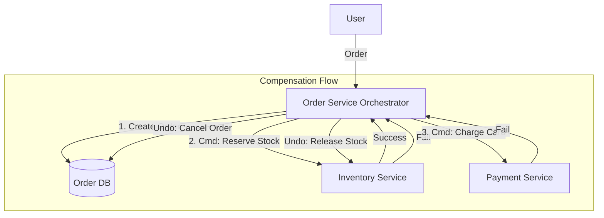

# 02. Distributed Transactions (Saga Pattern)

> **Part 3: Resilience & Fault Tolerance**  
> **Difficulty:** ⭐⭐⭐⭐⭐ (Architect)  
> **Status:** Critical Complexity

---

## 0. Learning Objectives

| Level | Goal |
|:---|:---|
| **Beginner** | Understand why `@Transactional` doesn't work across microservices. |
| **Developer** | Implement the Outbox Pattern and Compensating Transactions. |
| **Architect** | Choose between Choreography and Orchestration Sagas. |

---

## 1. Why This Topic Exists

### The ACID Problem
In a Monolith, `OrderRepository.save()` and `InventoryRepository.update()` run in the same DB Transaction. It's atomic.
In Microservices, they are different Databases.
You cannot hold a lock across two databases over the internet (2PC/XA is too slow).

### The Solution: Eventual Consistency
We accept there is a time gap where:
*   Order is Created.
*   Inventory is NOT YET updated.
We use **Sagas** to eventually align them, or **Compensate** (Undo) if something fails.

---

## 2. Big Picture Architecture View

**Orchestration Saga (The Conductor)**


---

## 3. Core Concepts (🟢 Beginner Level)

### Local Transaction
A standard DB transaction within one service. ACID guaranteed.

### Compensating Transaction
The "Undo" button.
*   *Action*: `reserveCredit($10)`
*   *Compensation*: `refundCredit($10)`

### Saga
A chain of Local Transactions.
`T1 -> T2 -> T3`.
If T3 fails, execute `C2 -> C1` (Compensations).

---

## 4. Developer Deep Dive (🟡 Professional Level)

### The Dual Write Problem (Atomic Events)
*   *Bad Code*:
    ```java
    @Transactional
    public void createOrder(Order order) {
        repo.save(order); // DB Write
        kafkaTemplate.send("orders", order); // Network Call
    }
    ```
    *   *Bug*: If DB commits but Kafka fails, the system is inconsistent.

### The Transactional Outbox Pattern
1.  **Table**: Create `outbox` table in the DB.
2.  **Transact**: Save `Order` AND save `Event` to `outbox` in the SAME transaction. (Guaranteed Atomicity).
3.  **Relay**: A background process (Debezium / Poller) reads `outbox` and pushes to Kafka.

---

## 5. Internal Mechanics (🔴 Architect Level)

### Choreography (Async Events)
*   **Flow**: Order emits `OrderCreated`. Inventory listens, does work, emits `InventoryReserved`. Payment listens...
*   **Pros**: Decoupled, simple to start.
*   **Cons**: **Cyclic dependencies**, hard to visualize flow (Spaghetti events).

### Orchestration (Central Brain)
*   **Flow**: `OrderSagaManager` tells Inventory to reserve. Waits for response. Tells Payment to charge.
*   **Pros**: Explicit flow, easier rollback logic.
*   **Cons**: Orchestrator becomes a "God Service".

---

## 6. Production & Failure Scenarios

### Scenario: The Lost Compensation
*   **Event**: Payment fails. Orchestrator sends "Refund" command to Inventory.
*   **Failure**: Inventory is down. Refund command fails.
*   **Result**: Inventory is permanently allocated for a failed order.
*   **Fix**: **Infinite Retry** for Compensations. You MUST eventually refund.

---

## 9. Architect-Level Best Practices

1.  **Pivot Transaction**: The point of no return. Steps before it are compensatable. Steps after it should rarely fail.
2.  **Idempotent Compensations**: `refund($10)` called twice should only refund once.
3.  **Avoid Sagas**: Seriously. If you can combine `Order` and `Inventory` into one service/database, do it. Use Sagas only when strict boundaries are required.

---

## 12. Interview Questions

### Basic
1.  What is a Distributed Transaction?
2.  Why is 2-Phase Commit (2PC) bad for Microservices? (Blocking, Latency).

### Intermediate
1.  Explain Choreography vs Orchestration.
2.  What is the "Dual Write" problem?

### Advanced
1.  How does the Outbox Pattern solve data consistency?
2.  How do you handle a failure during the Compensation phase? (Retry until manual intervention).

### Architect-Level
1.  Design a Payment Saga where the User's wallet is in Service A and the Merchant's wallet is in Service B.
2.  Analyze the consistency guarantees of Kafka Transactions vs Outbox Pattern.

---

## 14. Summary & Architect Takeaways

*   **ACID is dead**: Long live BASE (Basically Available, Soft state, Eventual consistency).
*   **Compensate**: Always think "How do I undo this?".
*   **Outbox**: The only reliable way to send events from a database transaction.
