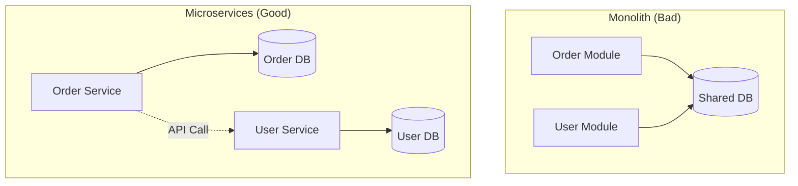

# 01. Database per Service Pattern

> **Part 4: Data & Consistency**  
> **Difficulty:** ⭐⭐⭐⭐ (Architect)  
> **Status:** Non-Negotiable

---

## 0. Learning Objectives

| Level | Goal |
|:---|:---|
| **Beginner** | Understand why sharing a database is bad. |
| **Developer** | Implement Foreign Keys *logically*, not physically. |
| **Architect** | Plan a migration from Shared DB to Private DBs. |

---

## 1. Why This Topic Exists

### The Shared Database Anti-Pattern
In a Monolith, `User Service` and `Order Service` read the same `USERS` table.
*   **Problem**: If `User Service` changes the table schema (renames column), `Order Service` breaks.
*   **Result**: Fear of change. Tightly coupled deployments.

### The Solution: Database per Service
Each microservice has its own persistent store.
*   **Isolation**: No other service can access the DB directly.
*   **API Access**: To get user data, you MUST call the User Service API.

---

## 2. Big Picture Architecture View



---

## 3. Core Concepts (🟢 Beginner Level)

### Logical vs Physical Separation
1.  **Private-Tables-per-Service**: Same physical DB server, different Schemas (`schema_order`, `schema_user`). (Cheaper, easier ops).
2.  **Database-per-Service**: Different physical DB servers. (Max isolation).

---

## 4. Developer Deep Dive (🟡 Professional Level)

### "Joins" in Microservices
You can't do `SELECT * FROM Orders o JOIN Users u ON o.uid = u.id`.
**Options**:
1.  **API Composition**:
    *   Fetch Order: `{ id: 1, userId: 100 }`.
    *   Call User Service: `GET /users/100`.
    *   Combine in code.
2.  **Data Replication (CQRS)**:
    *   When User updates name, publish event.
    *   Order Service listens and updates local `user_summary` table.

---

## 5. Internal Mechanics (🔴 Architect Level)

### Referential Integrity
In a Monolith, DB prevents you from deleting a User if they have Orders (Foreign Key Constraint).
In Microservices, **you lose this**.
*   *Fix*: **Soft Deletes**. Never delete data. Mark `is_deleted=true`.
*   *Fix*: **Sweeper Job**. Background process checking for orphans.

---

## 6. Production & Failure Scenarios

### Scenario: The N+1 Problem (Distributed)
*   **Code**:
    ```java
    List<Order> orders = orderRepo.findAll(); // 100 orders
    for (Order o : orders) {
        userClient.getUser(o.userId); // 100 Network Calls!
    }
    ```
*   **Result**: Latency explosion.
*   **Fix**: Batch API (`GET /users?ids=1,2,3...`).

---

## 9. Architect-Level Best Practices

1.  **Start with Schema Separation**: Don't spin up 50 RDS instances. Use 1 RDS with 50 Schemas. Move to separate servers only when scaling demands it.
2.  **No Backdoors**: Analytics/Reporting tools (Tableau) should access a **Data Warehouse**, not the production microservice DBs.
3.  **Cross-Service Transactions**: Are impossible. See Chapter 3.02 (Sagas).

---

## 12. Interview Questions

### Basic
1.  Why is "Shared Database" an anti-pattern?
2.  How do you ensure loose coupling with databases?

### Intermediate
1.  How do you perform a "Join" across two services?
2.  What is the "N+1 Problem" in microservices?

### Architect-Level
1.  Migrating a Monolith: How do you break Foreign Keys? (Refactoring step-by-step).
2.  Design a Reporting System that needs data from all services. (ETL / Data Lake). (Do not query prod DBs).

---

## 14. Summary & Architect Takeaways

*   **Your Data, Your Rules**: If you own the data, you define the schema. No one else can break you.
*   **Consistency Trade-off**: You gain Agility but lose ACID and Foreign Keys.
*   **Reporting**: Is harder. You need a separate Data strategy (ETL).
