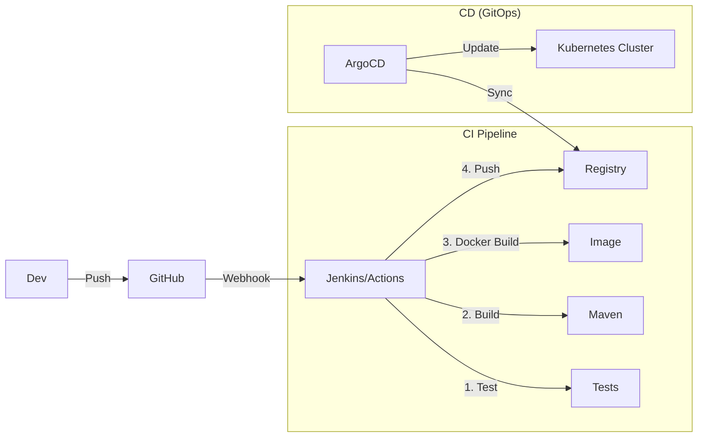

# 03. CI/CD Pipelines (Jenkins, GitHub Actions, ArgoCD)

> **Part 5: Infrastructure & DevOps**  
> **Difficulty:** ⭐⭐⭐⭐ (DevOps)  
> **Status:** Critical Efficiency

---

## 0. Learning Objectives

| Level | Goal |
|:---|:---|
| **Beginner** | Understand CI vs CD. |
| **Developer** | Write a `Jenkinsfile` or `.github/workflows`. |
| **Architect** | Implement **GitOps** with ArgoCD. |

---

## 1. Why This Topic Exists

### The Manual Bottleneck
*   Dev writes code.
*   Dev emails Ops.
*   Ops logs into server.
*   Ops runs `git pull`.
*   **Result**: Slow, Error-prone, No Audit trail.

### The Solution: Pipeline
Automated assembly line.
Code -> Test -> Build -> Scan -> Deploy.

---

## 2. Big Picture Architecture View

---

## 3. Core Concepts (🟢 Beginner Level)

### CI (Continuous Integration)
"Build and Test every commit".
*   If you break the build, fix it immediately.

### CD (Continuous Deployment)
"Deploy every passing build to Prod".
*   Requires extremely high confidence in tests.

---

## 4. Developer Deep Dive (🟡 Professional Level)

### Push vs Pull (GitOps)

**1. Push Model (Legacy)**
Jenkins runs `kubectl apply -f deployment.yaml`.
*   *Risk*: Jenkins needs Prod credentials (Security risk).

**2. Pull Model (GitOps)**
Jenkins updates `manifest.yaml` in Git.
**ArgoCD** (running inside K8s) sees the change in Git and pulls it.
*   *Benefit*: Cluster credentials never leave the cluster.

---

## 5. Internal Mechanics (🔴 Architect Level)

### Quality Gates
1.  **Unit Tests**: Must pass.
2.  **SonarQube**: Code coverage > 80%. No critical bugs.
3.  **Vulnerability Scan (Trivy)**: No critical CVEs in Docker Image.

---

## 9. Architect-Level Best Practices

1.  **Environment Promotion**: Build **once**. Deploy the **same image** to Dev, QA, Prod. Never rebuild for Prod (code might change).
2.  **Blue/Green Deployment**: Zero downtime. Spin up V2 next to V1. Switch traffic.
3.  **Ephemeral Environments**: Create a temporary K8s namespace for every Pull Request.

---

## 12. Interview Questions

1.  What is GitOps?
2.  Difference between Blue/Green and Canary?
3.  Why should you not store secrets in Jenkins?

---

## 14. Summary & Architect Takeaways

*   **Automation**: If you do it twice, automate it.
*   **Speed**: Feedback loops must be fast. If CI takes 1 hour, Devs wont use it.
