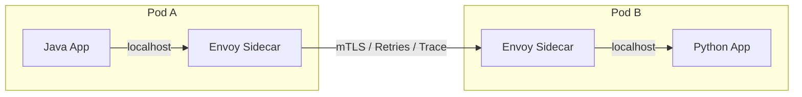

# 05. Service Mesh (Istio, Linkerd, Sidecar Pattern)

> **Part 5: Infrastructure & DevOps**  
> **Difficulty:** ⭐⭐⭐⭐⭐ (Advanced Architect)  
> **Status:** Cutting Edge / Optional

---

## 0. Learning Objectives

| Level | Goal |
|:---|:---|
| **Beginner** | Understand what a "Sidecar" is. |
| **Developer** | Stop writing Retry logic in Java code. |
| **Architect** | Decide if the complexity of Istio is worth the benefits (mTLS). |

---

## 1. Why This Topic Exists

### The Library Problem
We used `Resilience4j` (Java) for Circuit Breakers and `Eureka` (Java) for Discovery.
*   *Issue*: What about the Python Analytics service? What about the Node.js frontend?
*   You have to re-implement the same logic in every language.

### The Solution: Service Mesh
Move the network logic OUT of the application and INTO the infrastructure.
*   **Application**: Just talks to `localhost`.
*   **Sidecar (Proxy)**: Intercepts traffic, does mTLS, Retries, Circuit Breaking, and forwards to destination.

---

## 2. Big Picture Architecture View

---

## 3. Core Concepts (🟢 Beginner Level)

### Sidecar Pattern
A helper container running in the same Pod. They share the same Network IP.
It's like a personal secretary handling all phone calls.

### Control Plane (Istiod)
The brain that configures all the Sidecars.

---

## 4. Developer Deep Dive (🟡 Professional Level)

### Zero Code Changes
With Service Mesh, you don't need `@CircuitBreaker` annotations.
You write a standard HTTP client. The Mesh handles the timeout/retry.
*   *Benefit*: Your code is pure business logic.
*   *Drawback*: Debugging is harder. (Who failed? App or Proxy?).

---

## 5. Security (mTLS)

### Mutual TLS made easy
Istio automatically upgrades HTTP to HTTPS (mTLS) between proxies.
*   Auto-rotation of certificates.
*   Identity-based policies ("Service A can call Service B, but C cannot").

---

## 14. Summary & Architect Takeaways

*   **Do you need it?**: If you are 100% Java Spring Boot, you might not need it (Libraries are fine).
*   **Polyglot**: If you have Java, Go, Python, Node... Service Mesh is mandatory for consistent behavior.
*   **Complexity**: Istio is complex. Linkerd is simpler. Choose wisely.
