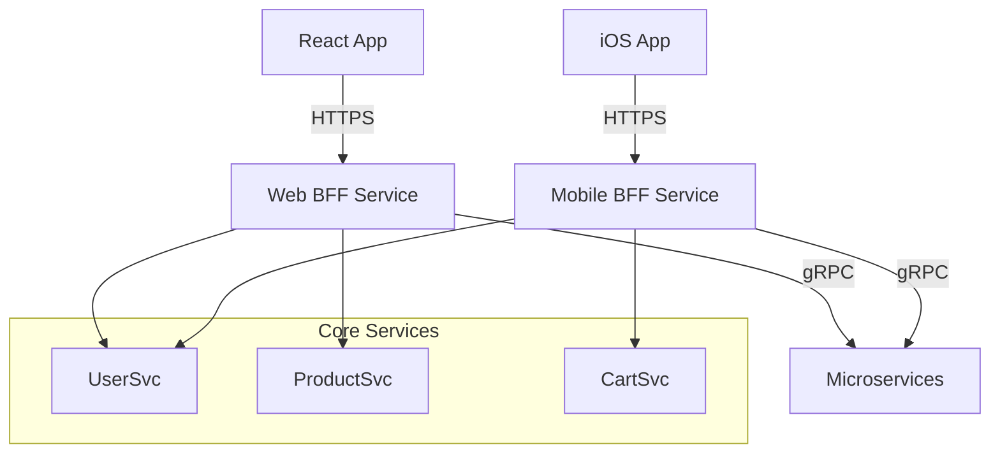

# 01. Backend for Frontend (BFF) Pattern

> **Part 8: Real-world Architecture Patterns**  
> **Difficulty:** ⭐⭐⭐ (Architect)  
> **Status:** User Experience Critical

---

## 0. Learning Objectives

| Level | Goal |
|:---|:---|
| **Beginner** | Understand why Mobile apps hate Desktop APIs. |
| **Developer** | Build a dedicated Spring Boot BFF for Mobile. |
| **Architect** | Define ownership boundaries (Frontend Team owns the BFF). |

---

## 1. Why This Topic Exists

### The General Purpose API Trap
*   **Service**: `GET /users/1` returns 50 fields (including `preferences`, `history`, `audit_logs`).
*   **Desktop App**: Needs all 50 fields. Happy.
*   **Mobile App**: Needs 3 fields (Name, Avatar).
    *   *Result*: Mobile wastes bandwidth downloading 47 useless fields. Battery drain. Slow UI.

### The Solution: BFF
create a specific API layer for a specific User Experience.
*   `MobileBFF` -> Calls `User Service`, filters fields, returns JSON.
*   `WebBFF` -> Calls `User Service`, returns detailed JSON.

---

## 2. Big Picture Architecture View

---

## 3. Core Concepts (🟢 Beginner Level)

### One Experience, One BFF
BFF is tightly coupled to the **Client**, not the Service.
If the iOS App changes a screen, the Mobile BFF changes. The Core Services stay stable.

### GraphQL as a BFF
GraphQL allows the client to ask for exactly what it needs (`{ user { name, avatar } }`).
*   **Pro**: Flexible.
*   **Con**: Easy to introduce "N+1 Problem". Complexity.

---

## 9. Architect-Level Best Practices

1.  **Ownership**: The **Frontend Team** should write the BFF. It's *their* data translation layer.
2.  **No Business Logic**: BFF should not calculate tax. It should just format the tax for display.
3.  **Keep it Thin**: If BFF becomes fat, you are building a Distributed Monolith.

---

## 14. Summary & Architect Takeaways

*   **Decoupling**: Core Services can evolve independently of UI changes.
*   **Performance**: Mobile apps are faster because payload size is optimized.
