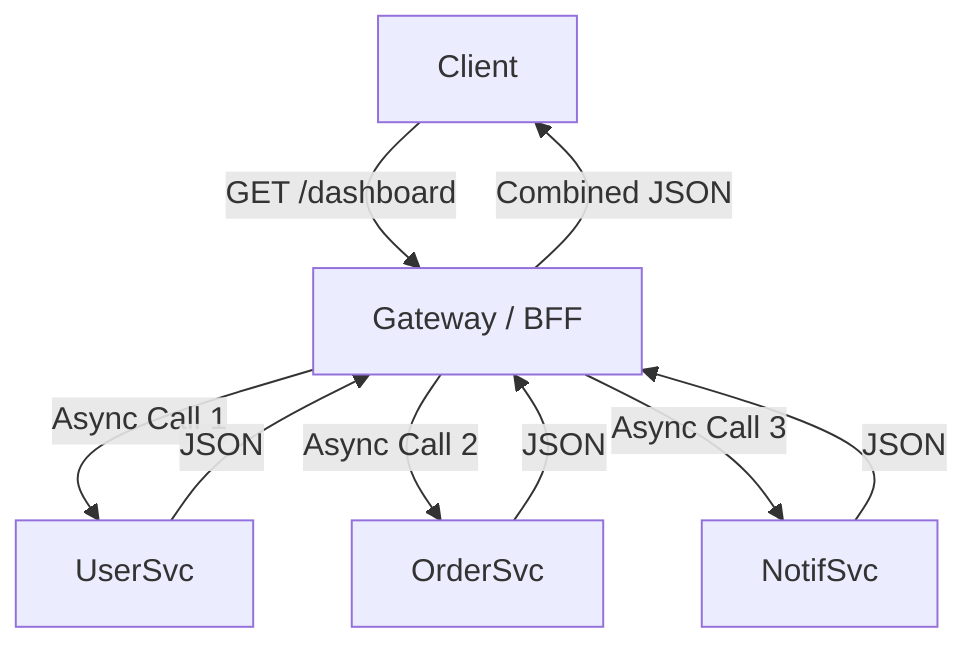

# 03. Aggregator Pattern (Gateway Composition)

> **Part 8: Real-world Architecture Patterns**  
> **Difficulty:** ⭐⭐⭐⭐ (Architect)  
> **Status:** Latency Optimization

---

## 0. Learning Objectives

| Level | Goal |
|:---|:---|
| **Beginner** | Understand Serial vs Parallel execution. |
| **Developer** | Implement `CompletableFuture.allOf()` to fetch User and Orders simultaneously. |
| **Architect** | design a resilient Aggregator that handles partial failures (Circuit Breakers). |

---

## 1. Why This Topic Exists

### The Chatty Client Problem
Mobile App needs: User Profile + Order History + Notifications.
1.  `GET /users/1` (100ms)
2.  `GET /orders?uid=1` (200ms)
3.  `GET /notifications` (50ms)
*   **Total Time**: 350ms (Serial).
*   **Battery**: Drained (Radio wakes up 3 times).

### The Solution: Aggregator
One endpoint `GET /dashboard`.
*   Server calls User + Order + Notifications in **Parallel**.
*   **Total Time**: Max(100, 200, 50) = 200ms.

---

## 2. Big Picture Architecture View

---

## 3. Core Concepts (🟢 Beginner Level)

### Fan-Out / Fan-In
*   **Fan-Out**: Scattering requests to multiple services.
*   **Fan-In**: Gathering responses and merging them into one DTO.

### Chained Pattern (The Anti-Pattern)
`Service A` calls `Service B`, which calls `Service C`.
*   **Latency**: Additive.
*   **Availability**: Multiplicative (0.99 * 0.99 * 0.99 = 0.97).
*   **Goal**: Flatter is better. Aggregator calls A, B, C directly.

---

## 4. Developer Deep Dive (🟡 Professional Level)

### Handling Partial Failures
What if `Order Service` is down?
1.  **Fail Whole Request**: 500 Error. (Bad UX).
2.  **Partial Content**: Return User + Notifications. Orders = `[]` or `null`. (Resilient).
    *   *Code*: Catch exception in `CompletableFuture` and return default.

---

## 14. Summary & Architect Takeaways

*   **GraphQL**: Is essentially a generic Aggregator.
*   **Bandwidth**: Aggregation saves the Client bandwidth (One JSON), but increases Server memory (Holding 3 JSONs before merging).
