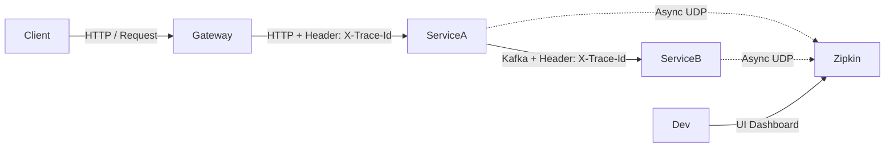

# 01. Distributed Tracing (Zipkin, Jaeger, Correlation IDs)

> **Part 9: Debugging & Troubleshooting**  
> **Difficulty:** ⭐⭐⭐⭐ (SRE)  
> **Status:** Essential for Observability

---

## 0. Learning Objectives

| Level | Goal |
|:---|:---|
| **Beginner** | Understand why `grep` doesn't work in Microservices. |
| **Developer** | Configure Spring Boot to add `traceId` to logs. |
| **Architect** | Design a Tracing Infrastructure using OpenTelemetry. |

---

## 1. Why This Topic Exists

### The Needle in the Haystack
*   **Monolith**: `grep "Order Failed" /var/log/tomcat/catalina.out`. (Easy).
*   **Microservices**: Request hits Gateway -> Auth -> Order -> Inventory -> Payment.
    *   Error happens in Payment.
    *   Auth logs say "Success". Order logs say "Success".
    *   **Problem**: How do you know which Payment log belongs to *that* Order request?

### The Solution: Correlation ID
Generate a GUID (`a1b2c3d4`) at the Gateway.
Pass it as a Header (`X-Trace-Id`) to every service.
Print it in every log line.

---

## 2. Big Picture Architecture View



---

## 3. Core Concepts (🟢 Beginner Level)

### Trace vs Span
*   **Trace**: The entire journey of a request (Gateway -> DB).
*   **Span**: A single step (Service A processing time).
*   **Context Propagation**: Passing the `Trace ID` across HTTP/Kafka boundaries.

### MDC (Mapped Diagnostic Context)
Java feature. Thread-local map.
*   Spring puts `traceId` into MDC at start of request.
*   Log4j reads MDC and prints `[traceId=...]` automatically.

---

## 4. Developer Deep Dive (🟡 Professional Level)

### Spring Boot 3 + Micrometer Tracing
Spring Cloud Sleuth is dead. Long live Micrometer.

**Dependencies**:
```xml
<dependency>
    <groupId>io.micrometer</groupId>
    <artifactId>micrometer-tracing-bridge-brave</artifactId>
</dependency>
<dependency>
    <groupId>io.zipkin.reporter</groupId>
    <artifactId>zipkin-reporter-brave</artifactId>
</dependency>
```

**Log Format**:
```text
2023-10-01 12:00:00 [order-service,65a12f,89b34c] INFO : Processing Order...
```
*   `65a12f`: Trace ID (Global).
*   `89b34c`: Span ID (Local).

---

## 14. Summary & Architect Takeaways

*   **100% Sampling?**: No. Tracing kills performance. Sample 1-10% of traffic in Prod.
*   **Visualization**: Logs tell you *what* happened. Tracing tells you *where* and *how long*.
