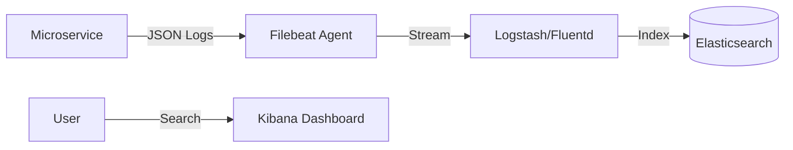

# 02. Log Aggregation (ELK Stack, Structured Logging)

> **Part 9: Debugging & Troubleshooting**  
> **Difficulty:** ⭐⭐⭐ (DevOps)  
> **Status:** Mandatory

---

## 0. Learning Objectives

| Level | Goal |
|:---|:---|
| **Beginner** | Stop using `tail -f` on production servers. |
| **Developer** | Configure Logback to output JSON instead of Text. |
| **Architect** | Choose between ELK (Search) and Loki (Grep). |

---

## 1. Why This Topic Exists

### The SSH Nightmare
You have 10 instances of `OrderService`.
The user reports an error.
*   **Old Way**: Open 10 terminal tabs. SSH into each. Run `tail -f`. Cry.
*   **New Way**: Open Kibana. Type `traceId="a1b2c3"`. See the log in 1 second.

---

## 2. Big Picture Architecture View



---

## 3. Core Concepts (🟢 Beginner Level)

### Structured Logging (JSON)
*   **Text Log**: `2023-10-01 INFO User 123 failed login`. (Hard to parse).
*   **JSON Log**: `{"timestamp": "...", "level": "INFO", "userId": 123, "event": "login_failed"}`. (Machine readable).
*   **Benefit**: You can query `userId:123` or `event:login_failed` instantly.

---

## 4. Developer Deep Dive (🟡 Professional Level)

### Logback JSON Configuration
Don't write parse logic in Logstash. Output JSON directly from Java.

```xml
<appender name="JSON" class="ch.qos.logback.core.ConsoleAppender">
    <encoder class="net.logstash.logback.encoder.LogstashEncoder">
        <customFields>{"app_name": "order-service"}</customFields>
    </encoder>
</appender>
```

### Loki (Grafana)
ELK is heavy (Java). Loki is light (Go).
*   **Difference**: ELK indexes *content* (Full Text Search). Loki indexes *labels* (Stream tags).
*   **Use Case**: If you just want to `grep` logs based on Time and Service Name, use Loki.

---

## 14. Summary & Architect Takeaways

*   **No PII**: Never log Credit Card numbers or Passwords. Use **Log Masking**.
*   **Retention**: Logs are expensive. Keep Debug logs for 3 days, Info logs for 30 days.
