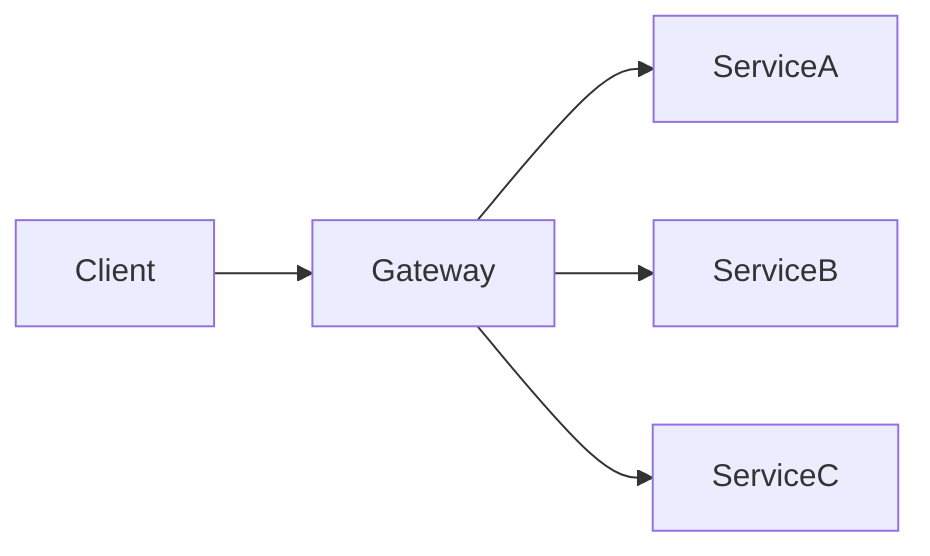

# API Gateway

> **Part 3: Core Components**  
> **Difficulty:** ⭐⭐⭐ (Intermediate)  
> **Status:** The Microservices Doorman

---

## 0. Learning Objectives
*   **Beginner**: Understand why Microservices need a single entry point.
*   **Developer**: Configure Rate Limiting and JWT Verification at the Gateway.
*   **Architect**: Design aggregation patterns to solve the "Chatty Client" problem.

---

## 1. Problem Context
**Why does this exist?**
You split your Monolith into 50 Microservices.
*   Does the Mobile App prefer to call 50 URLs? (`/users`, `/orders`, `/products`).
*   Does every Service implement Rate Limiting and Auth logic? (DRY Violation).
The **API Gateway** unifies the interface and centralizes cross-cutting concerns.

---

## 2. Core Concepts (🟢 Beginner Level)

### 1. The Facade
*   It looks like a Monolith to the client (One URL: `api.company.com`).
*   Internally, it routes to `inventory-service`, `payment-service`.

### 2. Cross-Cutting Concerns
*   Authentication (Who are you?).
*   Authorization (Can you do this?).
*   Rate Limiting (Stop spam).
*   Logging/Analytics.

---

## 3. Architecture Breakdown (🟡 Developer Level)

### Functions
1.  **Routing**: `GET /users` -> `User Service`.
2.  **Offloading**: Gateway checks JWT. Service assumes user is authenticated.
3.  **Transformation**: XML in -> JSON out. (Legacy adaptation).
4.  **Protocol Translation**: HTTP in -> gRPC/AMQP internal.

---

## 4. Internal Mechanics (🔴 Architect Level)

### 1. The Aggregator Pattern
*   **Problem**: Mobile App needs User Details + Last Order + Recommendation. (3 Calls).
*   **Solution**: Gateway executes 3 calls (in parallel) and returns 1 JSON.
*   *Risk*: Gateway becomes business logic coupled.

### 2. The Bottleneck Risk
*   If the Gateway dies, **Everything** dies.
*   It must be high-performance (Async/Non-blocking like Netty/Node.js).

---

## 5. Trade-Off Analysis

| Strategy | Pros | Cons |
| :--- | :--- | :--- |
| **Direct Client-to-Service** | Low Latency. No SPOF. | Complex Client. Security nightmare. |
| **API Gateway** | Simple Client. Centralized Security. | SPOF. Added Latency. Cost. |
| **BFF (Backend for Frontend)** | Tailored API for Mobile/Web. | Code duplication across BFFs. |

---

## 6. Scaling Considerations

### Gateway Clustering
*   The Gateway itself effectively needs a Load Balancer in front of it.
*   It acts as a stateless compute layer. You can scale it horizontally.

---

## 7. Failure Scenarios & Recovery

### 1. The Thundering Herd
*   **Scenario**: System restarts. 1M Users hit Gateway.
*   **Gateway**: Forwards 1M requests to User Service.
*   **User Service**: Dies.
*   **Fix**: **Rate Limiting** (Token Bucket) on the Gateway to protect downstream.

---

## 8. Security Considerations

### 1. The Gatekeeper
*   Gateway is the *only* component with a Public IP.
*   All Microservices reside in Private Subnets.
*   **AuthZ**: Gateway passes `X-User-Id` header. Services trust it **only if** it comes from Gateway IP (Security Group rules).

---

## 9. Performance Considerations

*   **Latency**: Gateway adds ~5-20ms.
*   **Optimization**: Use Caching at the Gateway level for common reads (`GET /products`).

---

## 10. Real Production Lessons

### The "Logic Creep"
*   **Mistake**: Developers put business logic (if/else) in Gateway to save time.
*   **Result**: Gateway becomes a Monolith 2.0. Hard to deploy.
*   **Rule**: Gateway does Routing & Security *Only*. Logic belongs in Services.

---

## 11. Interview Questions

### Basic
1.  What is an API Gateway?
2.  Difference between API Gateway and Load Balancer. (Routing vs Distributing).
3.  Name 3 benefits of a Gateway.
4.  What is Rate Limiting?
5.  What is a BFF?

### Intermediate
1.  How does a Gateway handle Authentication? (JWT Validation).
2.  Explain the Token Bucket algorithm.
3.  Can a Gateway cache responses?
4.  How do you handle versioning (`/v1`, `/v2`) in a Gateway?
5.  What is "Request Coalescing" in a Gateway?

### Advanced
1.  Design a Gateway that handles GraphQL Federation.
2.  Analyze the performance impact of JSON serialization in the Gateway.
3.  How do you implement Circuit Breaking in the Gateway (Netflix Zuul/Hystrix)?
4.  Compare Kong (Nginx based) vs Spring Cloud Gateway (Java based).
5.  Strategies for handling Partial Failures in an Aggregation call.

### Architect-Level
1.  "We want to move from monolithic auth to centralized OIDC." Architect the Gateway transition.
2.  Design a globally distributed Gateway with Geofencing implementation.
3.  Critique the decision to use AWS API Gateway (Managed) vs Self-Hosted Kong. (Cost at scale).

---

## 12. Scenario-Based System Design Problems

### 1. Design Netflix API
*   **Requirement**: Different data for TV, Mobile, Desktop.
*   **Choice**: BFF Pattern. `TV-Gateway`, `Mobile-Gateway`.

### 2. Design Github API
*   **Requirement**: Strict Rate Limiting (5000 req/hr).
*   **Choice**: API Gateway key-based throttling with Redis counter.

---

## 13. Summary & Architect Takeaways

1.  **Centralize Infrastructure, Decentralize Logic**: Auth and Logging belong here. Validating "Is Order > $50" does not.
2.  **Protect the Core**: The Gateway is the shield for your fragile microservices.
3.  **Monitor the Monitor**: If Gateway latency spikes, your entire business is slow.
